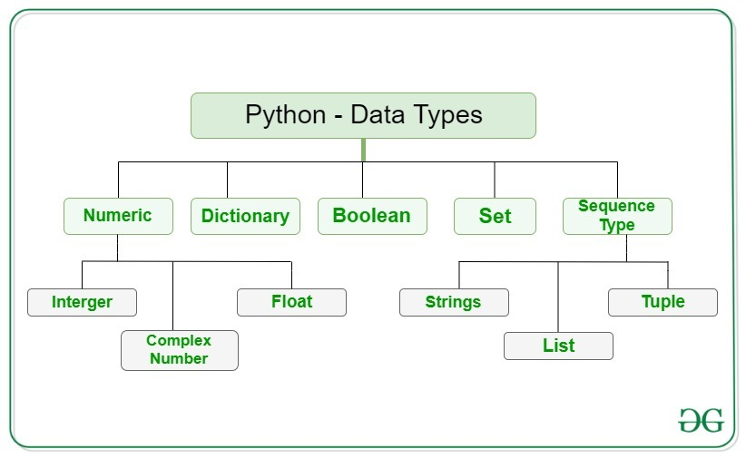

# DAY 1

## Pythons Syntax & Data type 

* Started with Python,<br>
The basic syntax of Python printing statements and how the concatenation is done. Then, moving on to data types, there are 5 main categories of data types. 



# DAY 2

## Pythons Data type Implementation and Operations 

* Learned the implementation of Boolean, Integer, Float, String, Dictionary, Set, List and tuple
```python
# String
my_string = "Hello, Python!"
print(f"String: {my_string}")
print(f"Length of the string: {len(my_string)}")
print(f"Uppercase: {my_string.upper()}")
print(f"Substring: {my_string[0:5]}")
print()

# List
my_list = [1, 2, 3, 4, 5]
print(f"List: {my_list}")
print(f"Length of the list: {len(my_list)}")
my_list.append(6)
print(f"List after append: {my_list}")
print(f"First element: {my_list[0]}")
print(f"Slice of list: {my_list[1:4]}")
print()

# Tuple
my_tuple = (10, 20, 30, 40, 50)
print(f"Tuple: {my_tuple}")
print(f"Length of the tuple: {len(my_tuple)}")
print(f"First element: {my_tuple[0]}")
print(f"Slice of tuple: {my_tuple[1:4]}")
print()

# Dictionary
my_dict = {"name": "Alice", "age": 25, "city": "New York"}
print(f"Dictionary: {my_dict}")
print(f"Length of the dictionary: {len(my_dict)}")
print(f"Value for 'name': {my_dict['name']}")
my_dict["email"] = "alice@example.com"
print(f"Dictionary after adding 'email': {my_dict}")
print(f"All keys: {list(my_dict.keys())}")
print(f"All values: {list(my_dict.values())}")
print()

# Set
my_set = {1, 2, 3, 4, 5}
print(f"Set: {my_set}")
print(f"Length of the set: {len(my_set)}")
my_set.add(6)
print(f"Set after adding 6: {my_set}")
my_set.update([7, 8, 9])
print(f"Set after adding multiple elements: {my_set}")
my_set.remove(3)
print(f"Set after removing 3: {my_set}")
print()

# Boolean
is_active = True
is_admin = False
print(f"Boolean is_active: {is_active}")
print(f"Boolean is_admin: {is_admin}")
print(f"Logical AND: {is_active and is_admin}")
print(f"Logical OR: {is_active or is_admin}")
print()

# NoneType
my_none = None
print(f"NoneType variable: {my_none}")
print(f"Is NoneType variable None? {my_none is None}")
print()

# Integer
my_int = 42
print(f"Integer: {my_int}")
print(f"Integer after addition: {my_int + 8}")
print(f"Integer after multiplication: {my_int * 2}")
print()

# Float
my_float = 3.14
print(f"Float: {my_float}")
print(f"Float after addition: {my_float + 2.0}")
print(f"Float after multiplication: {my_float * 2}")
print()

# Complex Number
my_complex = 2 + 3j
print(f"Complex number: {my_complex}")
print(f"Real part: {my_complex.real}")
print(f"Imaginary part: {my_complex.imag}")
print(f"Complex number after addition: {my_complex + (1 + 2j)}")
print(f"Complex number after multiplication: {my_complex * 2}")

```
* Arithmetical operation, Membership Operator and Assignment Operation
```python
# Addition
a = 15
b = 10
addition = a + b
print(f"Addition: {a} + {b} = {addition}")

# Subtraction
subtraction = a - b
print(f"Subtraction: {a} - {b} = {subtraction}")

# Multiplication
multiplication = a * b
print(f"Multiplication: {a} * {b} = {multiplication}")

# Division
division = a / b
print(f"Division: {a} / {b} = {division}")

# Modulus
modulus = a % b
print(f"Modulus: {a} % {b} = {modulus}")

# Exponentiation
exponentiation = a ** b
print(f"Exponentiation: {a} ** {b} = {exponentiation}")

# Floor Division
floor_division = a // b
print(f"Floor Division: {a} // {b} = {floor_division}")

# Additional Example with Float Numbers
x = 15.5
y = 2.5

# Addition with floats
add_float = x + y
print(f"Addition with floats: {x} + {y} = {add_float}")

# Subtraction with floats
subtract_float = x - y
print(f"Subtraction with floats: {x} - {y} = {subtract_float}")

# Multiplication with floats
multiply_float = x * y
print(f"Multiplication with floats: {x} * {y} = {multiply_float}")

# Division with floats
divide_float = x / y
print(f"Division with floats: {x} / {y} = {divide_float}")

# Modulus with floats
modulus_float = x % y
print(f"Modulus with floats: {x} % {y} = {modulus_float}")

# Exponentiation with floats
exponentiate_float = x ** y
print(f"Exponentiation with floats: {x} ** {y} = {exponentiate_float}")

# Floor Division with floats
floor_divide_float = x // y
print(f"Floor Division with floats: {x} // {y} = {floor_divide_float}")

```
```python
# Membership in a string
my_string = "Hello, Python!"
char = 'P'
print(f"Is '{char}' in '{my_string}'? {'Yes' if char in my_string else 'No'}")
char = 'Z'
print(f"Is '{char}' in '{my_string}'? {'Yes' if char in my_string else 'No'}")

# Membership in a list
my_list = [1, 2, 3, 4, 5]
element = 3
print(f"Is {element} in {my_list}? {'Yes' if element in my_list else 'No'}")
element = 6
print(f"Is {element} in {my_list}? {'Yes' if element in my_list else 'No'}")

# Membership in a tuple
my_tuple = (10, 20, 30, 40, 50)
element = 20
print(f"Is {element} in {my_tuple}? {'Yes' if element in my_tuple else 'No'}")
element = 60
print(f"Is {element} in {my_tuple}? {'Yes' if element in my_tuple else 'No'}")

# Membership in a dictionary (checks keys only)
my_dict = {"name": "Alice", "age": 25, "city": "New York"}
key = "name"
print(f"Is '{key}' in {my_dict}? {'Yes' if key in my_dict else 'No'}")
key = "email"
print(f"Is '{key}' in {my_dict}? {'Yes' if key in my_dict else 'No'}")

# Membership in a set
my_set = {1, 2, 3, 4, 5}
element = 4
print(f"Is {element} in {my_set}? {'Yes' if element in my_set else 'No'}")
element = 7
print(f"Is {element} in {my_set}? {'Yes' if element in my_set else 'No'}")

# Using 'not in' operator
element = 8
print(f"Is {element} not in {my_set}? {'Yes' if element not in my_set else 'No'}")

```
```python
# Basic Assignment
a = 10
print(f"a = {a}")

# Addition Assignment
a += 5
print(f"a += 5 -> {a}")

# Subtraction Assignment
a -= 3
print(f"a -= 3 -> {a}")

# Multiplication Assignment
a *= 2
print(f"a *= 2 -> {a}")

# Division Assignment
a /= 4
print(f"a /= 4 -> {a}")

# Modulus Assignment
a %= 3
print(f"a %= 3 -> {a}")

# Exponentiation Assignment
a **= 2
print(f"a **= 2 -> {a}")

# Floor Division Assignment
a //= 2
print(f"a //= 2 -> {a}")

# Bitwise AND Assignment
b = 5
b &= 3
print(f"b &= 3 -> {b}")

# Bitwise OR Assignment
b |= 2
print(f"b |= 2 -> {b}")

# Bitwise XOR Assignment
b ^= 1
print(f"b ^= 1 -> {b}")

# Bitwise Right Shift Assignment
b >>= 1
print(f"b >>= 1 -> {b}")

# Bitwise Left Shift Assignment
b <<= 1
print(f"b <<= 1 -> {b}")

```
* Length function
```python
my_string = "Hello, World!"
print(f"The length of the string is: {len(my_string)}")

```
* Example: [Day2](https://github.com/subhajyoti-prusty/RINEX_Data_Science/blob/bfe874f90c4b1c77923382999693c6c6fb499930/Day2.ipynb)


#DAY 3

## Python Loops 

* If else loop
```Python
  if(2>3):
    print("True")
else: 
    print("False")

if(2<3):
    print("True")
else: 
    print("False")
```
* Elif loop
```Python
Name = input("Hey, Enter your name: ")
print(f"Enter your mark, {Name}: ")
Mark = int(input())

if Mark >= 90 and Mark <= 100:
    print("Your grade is A")
elif Mark > 70 and Mark < 90:
    print("Your grade is B")
elif Mark > 50 and Mark <= 70:
    print("Your grade is C")
elif Mark >= 40 and Mark <= 50:
    print("Your grade is D")
elif Mark < 40:
    print("Your grade is F")
else:
    print("Invalid Mark, Try to enter correct mark")
```
* For loop
```Python
print("THE EVEN NUMBERS")
for i in range(1,101):
    if(i%2 == 0):
        print(i)
        
print("THE ODD NUMBERS")
for i in range(1,101):
    if(i%2 == 1):
        print(i)
```
* While loop
```Python
i = 4
while i <= 10:
    print(i)
    i+=1
```
* Break and continue
```Python
i = 4
while i <= 10:
    print(i)
    if i == 7:
        break
    i+=1

i = 4
while i <= 10:
    print(i)
    if i == 7:
        continue
    i+=1
```
* Example: [Day3](https://github.com/subhajyoti-prusty/RINEX_Data_Science/blob/bfe874f90c4b1c77923382999693c6c6fb499930/Day3.ipynb)
